# Digital Clock with Dynamic Day/Night + Weather Effects

<table>
  <tr>
    <td>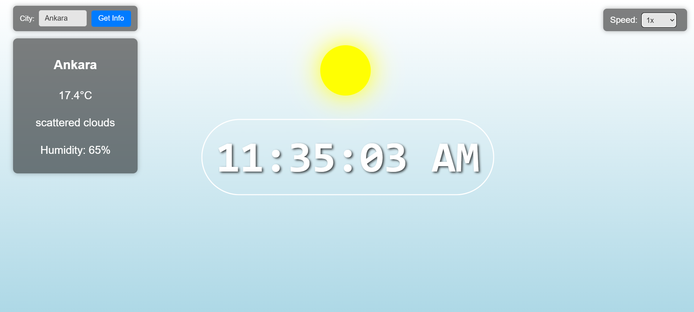</td>
    <td>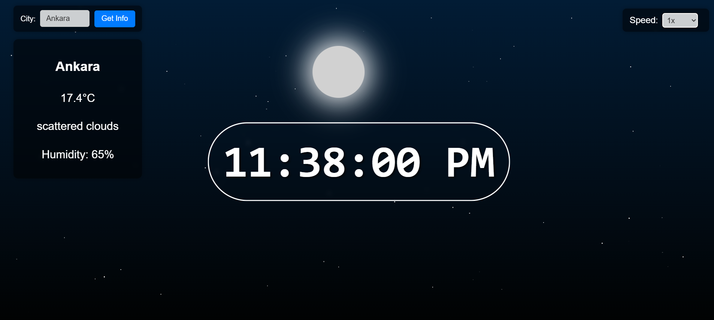</td>
  </tr>
</table>

This is a dynamic **digital clock weather simulation app** that changes not only based on **real-time sun/moon movement** but also adapts to the **live weather conditions** of the selected city. Effects like **rain, snow, fog, and clouds** are animated over the sky background.

### 🌐 [Live Demo on Vercel](https://digital-clock-dynamic-day-night.vercel.app/)

---

## Features

- Real-time digital clock with 12-hour format
- 🌞 Sun and 🌜 Moon follow a realistic arc across the sky
- Stars fade in/out at night with twinkling animation
- Smooth transitions between day/night using blend and easing
- Adjustable speed controls for simulating time faster
- Weather-dependent background animations:
  - ☁️ Cloudy
  - 🌧️ Rain
  - ❄️ Snow
  - 🌫️ Fog
- City selector that fetches real-time weather and time data via API
- Fully animated UI using React & CSS modules

---

## Technologies Used

- **React.js**
- **HTML & CSS (custom animations, effects, and layout)**
- **OpenWeatherMap API** for live weather data
- **Modular Components** and **custom Hooks** (`useWeather`)
- **CSS Animations** and easing logic

---

## 📂 Project Structure

<pre>
src/
├── assets/                       # Icons, background images
├── components/                  # Clock, effects, UI panels
│   ├── CityInput.jsx            # User input for city selection
│   ├── CloudEffect.jsx          # Cloud animation layer
│   ├── DigitalClock.jsx         # Time display
│   ├── FogEffect.jsx            # Fog particles
│   ├── Moon.jsx                 # Moon arc logic
│   ├── RainEffect.jsx           # Rain animation
│   ├── SnowEffect.jsx           # Snow animation
│   ├── Stars.jsx                # Night twinkling stars
│   ├── Sun.jsx                  # Sun path and blending
│   ├── WeatherEffects.jsx      # Combined weather effect manager
│   └── WeatherPanel.jsx        # Info panel for city and weather
├── hooks/
│   └── useWeather.js           # Custom hook for fetching weather API
├── styles/
│   ├── cityinput.css
│   ├── cloudEffect.css
│   ├── digitalClock.css
│   ├── fogEffect.css
│   ├── global.css
│   ├── moon.css
│   ├── rainEffect.css
│   ├── snowEffect.css
│   ├── stars.css
│   ├── sun.css
│   └── weatherPanel.css
├── App.jsx                      # Core app logic (clock, sky, effects)
├── App.css
├── index.css
└── main.jsx                     # App root
</pre>

---

## How It Works

- The app simulates **virtual time** using `setInterval`, optionally accelerated by speed controls.
- **City input** triggers a weather fetch that sets:
  - Time zone offset (syncs digital clock to city's local time)
  - Current weather condition (e.g., "Snow", "Rain", "Clouds", "Clear")
- The correct **sky condition components** are rendered dynamically based on weather type.
- **Sun & Moon** movement follows a smooth trigonometric arc using sine easing.
- **Stars** are visible only at night and animated using CSS keyframes.

---

## Setup & Development

```bash
  git clone https://github.com/SKT1803/digital-clock-dynamic-day-night
  cd digital-clock-dynamic-day-night
  npm install
  npm run dev
```

## Preview: Version 1

<table>
  <tr>
    <td>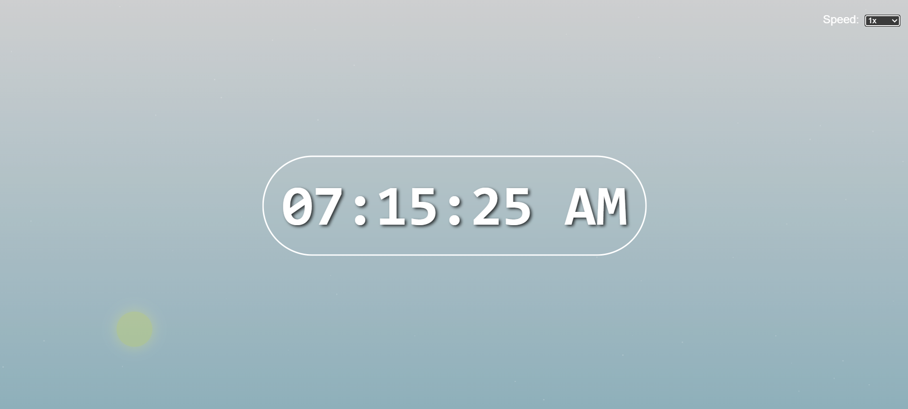</td>
    <td>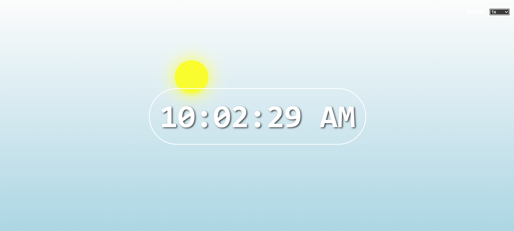</td>
  </tr>
 <tr>
    <td>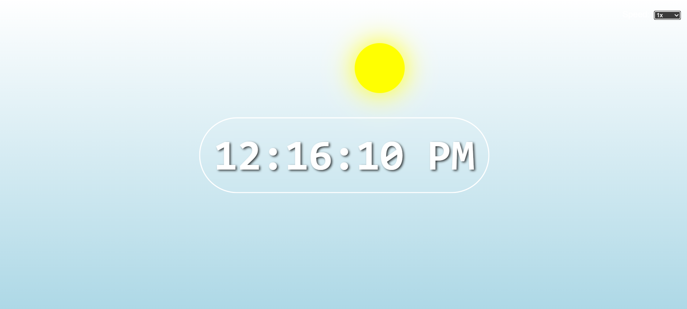</td>
    <td>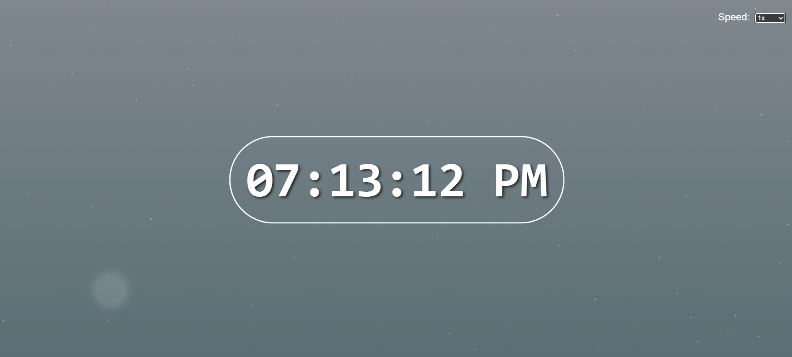</td>
  </tr>
   <tr>
    <td>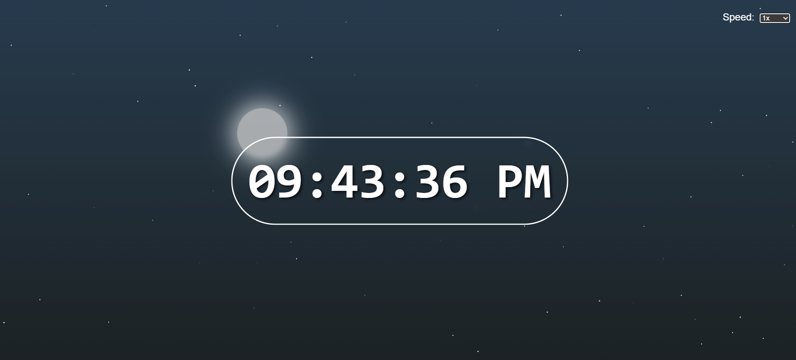</td>
    <td>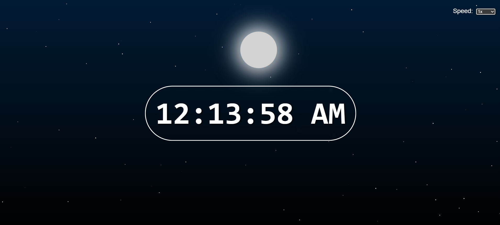</td>
  </tr>
  <tr>
    <td>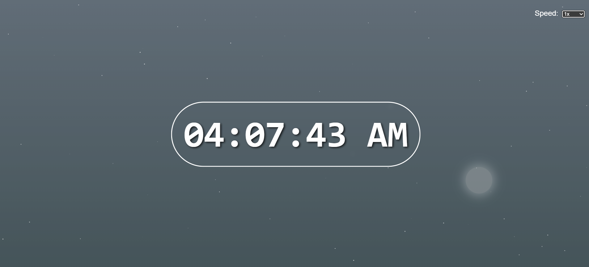</td>
    <td></td>
  </tr>
</table>

---

## Note
- The app gracefully handles API timeouts and falls back to local time if necessary.
- Weather effects are rendered using layered CSS animations, not WebGL or canvas.

---
## Preview: Version 2


☁️ Cloudy
<table>
  <tr>
    <td>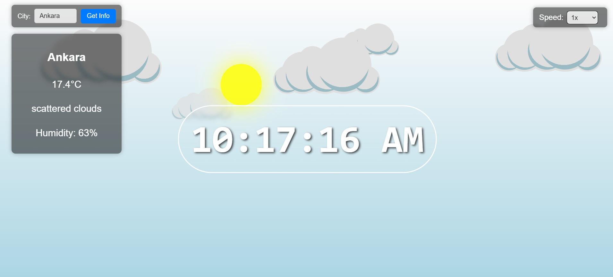</td>
    <td>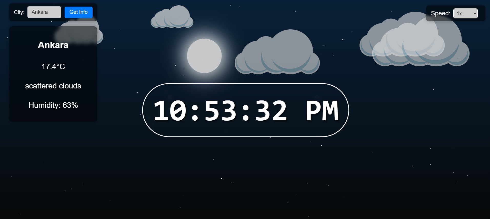</td>
  </tr>
</table>
🌧️ Rain
  <table>
 <tr>
    <td>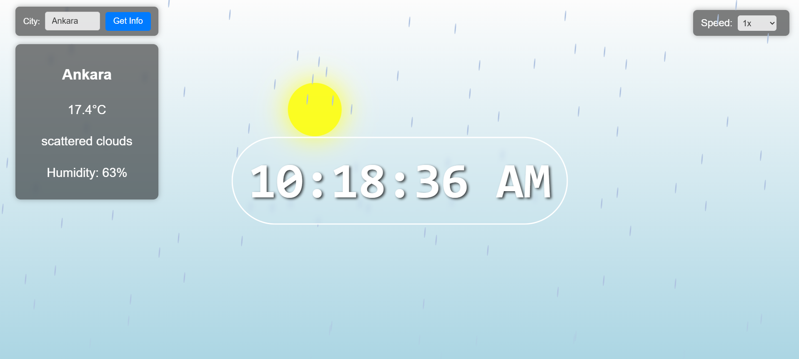</td>
    <td>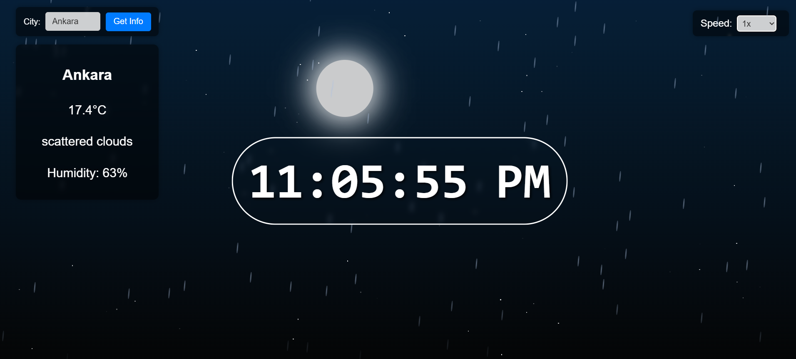</td>
  </tr>
  </table>
❄️ Snow
  <table>
   <tr>
    <td>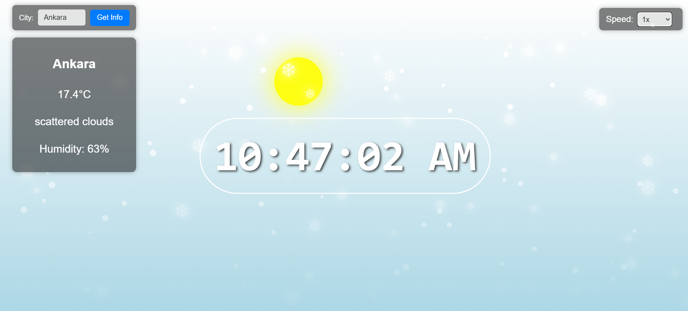</td>
    <td>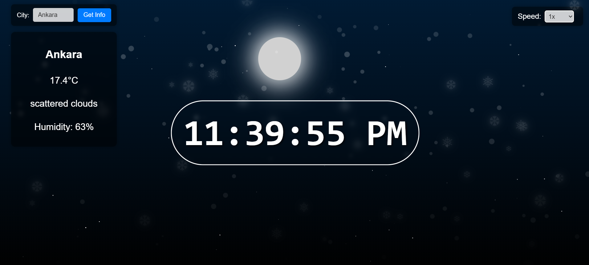</td>
  </tr>
  </table>
🌫️ Fog
  <table>
  <tr>
    <td>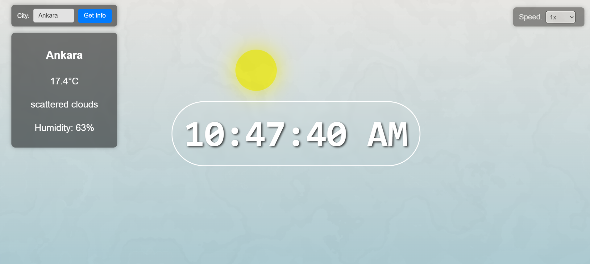</td>
    <td>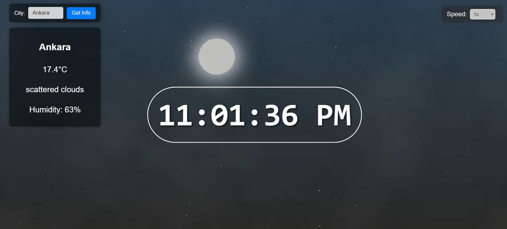</td>
  </tr>
</table>
